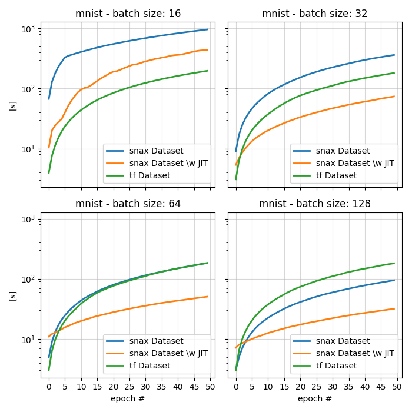
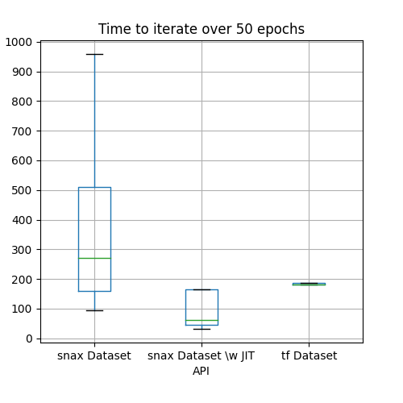

# SNax
## Versatile data ingestion pipelines for `jax`
The pun is very intended.


## Installation 
```sh
pip install "git+https://github.com/jhn-nt/data-snax.git"
```


## What is SNAX?
`snax` (pronounced _snacs_) is a lightweight python library written in [jax](https://jax.readthedocs.io/en/latest/) to accomodate jax-based model data injestion needs.
Developed with `jax` in mind, it offers a simple interface to quickly plug, transform, combine and batch  data. Infact, `snax` leverages `jax` primitives thus inherting its lightning speed.

## But why?
More than a necessity, `snax` aims at improving general quality of life when working with data loaders in `jax`, citing the [docs](https://jax.readthedocs.io/en/latest/notebooks/neural_network_with_tfds_data.html#:~:text=There%20are%20already%20a%20lot%20of%20great%20data%20loaders%20out%20there%2C%20so%20let%E2%80%99s%20just%20use%20them%20instead%20of%20reinventing%20anything.):  

_"There are already a lot of great data loaders out there, so let’s just use them instead of reinventing anything."_  

However, to naively use `tf.data.Dataset` in conjuction with `jax` as suggested by the devs may raise some nuisances, particularly:  
1. Memory conflicts: both `tensorflow` and `jax` try to allocate all available vRAM, which my cause one or the other not work properly.  
2. Type casting: All tensors should be cast to the appropriate equivalent type in `jax`.  

Again, these issues may be avoided with some research on stack overflow, morever `tf.data.Dataset` was developed by the `tensorflow` team and had been tested thorugly on many scenarios.  
But for tasks that can run on your machine, `snax` is a quick alternative to dive in `jax` without worrying about unneccessary details.


## Well then, but how does it work?  
If you are familiar with how [tf.data](https://www.tensorflow.org/guide/data) works then there is not much more for you to learn:  
__`snax` aims to replicate as closely as possible the API and behavior of `tf.data` in order to maintain compatibility with its _legacy_.__  
Instead of `tf.data.Dataset` there is `snax.data.Dataset`, instead of `tf.data.Dataset.from_tensor_slices` there is `snax.data.Dataset.from_tensor_slices` et cetera.   

```python
import snax as sn
import tensorflow as tf

X_y=(X,y) # some random dataset

# creating a dataset from tensors
sn_dataset=sn.data.Dataset.from_tensor_slices(X_y) # snax
tf_dataset=tf.data.Dataset.from_tensor_slices(X_y) # tensorflow

# applying transformations
sn_dataset=sn_dataset.map(lambda x,y: (x**2,y)).skip(10000) # snax
tf_dataset=tf_dataset.map(lambda x,y: (x**2,y)).skip(10000) # tensorflow

# consuming the data
for batch in sn_dataset.batch(32): # snax
  model.fit(batch)

for batch in tf_dataset.batch(32): # tensorflow
  model.fit(batch)
```
If not familir with these APIs I suggest to read through the [tensorflow tutorials](https://www.tensorflow.org/guide/data) first, which are exceptionally well documented.


Additionally `snax` also supports a limited portfolio of datasets offered via `tensorflow_datasets` in its `snax.datasets` module which I hope to extend in the future. 

```python
import snax.datasets as snds
import tensorflow_datasets as tfds

# loading a dataset
sn_dataset=snds.load("mnist") # snax
tf_dataset=tfds.load("mnist") # tensorflow
```

## Accellerating data trasformation with `snax.jit()`
`jax` introduces several new features, amongst which the abilty to _jit_ functions.  
[jax.jit()](https://jax.readthedocs.io/en/latest/_autosummary/jax.jit.html#jax.jit) particularly shines (more [here](https://jax.readthedocs.io/en/latest/jax-101/02-jitting.html#when-to-use-jit:~:text=30-,When%20to%20use%20JIT,-%23)) when applied to complex functions that needs to be called many times, for example with complex models or for  _transformations applied to data batches_.  
`snax.data.Dataset` supports `jax.jit` via the `jit()` method which _jits_ all _mapped_ transformations in one single encapsulation hence _increasing by a significant margin_ the rate of data injestion.  
This feature is most useful when applied __after__ one or more `map` calls. 

```python
import snax as sn
import snax.datasets as snds
import flax.linen as nn
import jax.numpy as jnp

ds=snds.load("mnist")["train"]

# defining a preprocessing function with some casting and matrix multiplication
W=jnp.ones((784,256))
def processing(input):
  image=input["image"]
  x=image.astype("float32")/255
  x=jnp.reshape(x,(-1,))
  return {"image":nn.relu(jnp.matmul(x,W)),"label":input["label"]}

# creating a dataset from tensors
sn_dataset=ds.map(processing)
jitted_sn_dataset=sn_dataset.jit() # boosting performance
```
In a small scale testing experiment, the use of  `snax.jit()` increased speed on average by 23% compared to `tf.data.Dataset` and by 68% compared to vanilla `snax.data.Dataset`.


## A note on performance
`snax.data.Dataset` can iterate through batches with impressive speed, even more when leveraging `snax.jit()`.
It is to note however that `snax.data.Dataset` cannot replace `tf.data.Dataset` since it cannot scale as `tf.data.Dataset` and it is not as stable as `tf.data.Dataset`. Infact, the stability of `tf.data.Dataset` is impressive, even when changing batch sizes by an order magnitude the time to iterate over a batch changes on average only by __.10 seconds__, wow.    
  

## Differences between `snax.data.Dataset` and `tf.data.Dataset`
In this current version it supports:  
  1. `map`: behavior is similar to that of `tf.data.Dataset.map`  
  2. `take`: behavior is similar to that of `tf.data.Dataset.take`  
  3. `skip`: behavior is similar to that of `tf.data.Dataset.skip`  
  4. `zip`: behavior is similar to that of `tf.data.Dataset.zip`  
  5. `shuffle`: behavior is similar to `tf.data.Dataset.shuffle` but with different input signature, instead of a `buffer_size` it requires a `jax.random.PRNGKey`.  
  ```python
import snax as sn
import tensorflow as tf
from jax.random import PRNGKey

X_y=(X,y) # some random dataset

# creating a dataset from tensors
sn_dataset=sn.data.Dataset.from_tensor_slices(X_y) # snax
tf_dataset=tf.data.Dataset.from_tensor_slices(X_y) # tensorflow

# difference in `shuffle` behavior
sn_dataset=sn_dataset.shuffle(PRNGKey(0)) # snax
tf_dataset=tf_dataset.shuffle(1024) # tensorflow
```
  6. `batch`: similar behavior to `tf.data.Dataset.batch` but completely different mechanics.
      No other transformation can be applied after a `batch` call.
  ```python
import snax as sn
import tensorflow as tf

X_y=(X,y) # some random dataset

# creating a dataset from tensors
sn_dataset=sn.data.Dataset.from_tensor_slices(X_y) 
sn_dataset.batch(1024).map(lambda x,y: x**2) ## this will raise an error
sn_dataset.map(lambda x,y: x**2).batch(1024) ## this will not

```

What it does not yet support:
  1. `apply`
  2. `from_generator`
  3. `concatenate`
  4. `bucket_by_sequence_lenght`
  5. `filter`


## A brief history of SNAX
As soon as I came up with the name `snax` while thinking about how geniously named is deep-mind [rlax](https://rlax.readthedocs.io/en/latest/index.html=),  I realized I had to release a `jax` injestion package with such a name.    
I figured how to do it afterward.


## Disclaimer
`snax` was developed as an excercise to learn bits of the `jax` ecosystem and perhaps for the enjoyment of the community.  
It does not have any professional ambition nor does it hold any technical or scientific quality to be so. 

Feel free to contribute  

Cheers